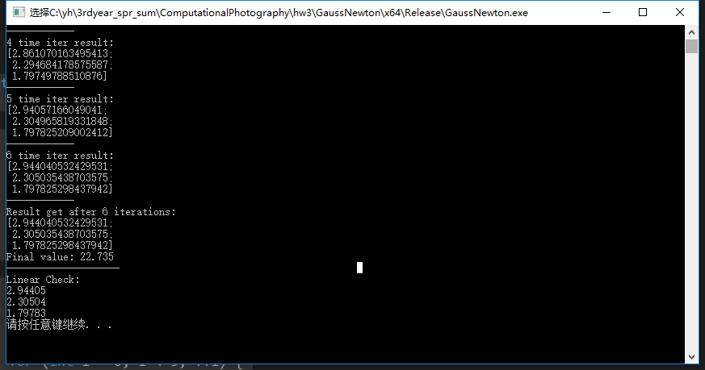

# Lab 5 - 非线性最小二乘

3150104251 杨晗

[TOC]

## 实验目的

使用GaussNewton法求解一个非线性最小二乘问题。

这里具体的问题是用 

$$ \frac{x^2}{A^2}+\frac{y^2}{B^2}+\frac{z^2}{C^2} = 1$$

来拟合753个数据点组成的三维点云。

## 实验原理

### 牛顿法

求一个函数的最小值可以使用Newton法，即使用迭代的方法求解导数为零的点。

目标函数 f(x) 在点 $k_x$ 的泰勒展示式前三项为：


$$
{J_k}(x)  = f({x_k}) + J_k^T(x - {x_k}) + \frac{1}{2}{(x - {x_k})^T}{H_k}(x - {x_k}) + o(x - {x_k})
$$


其中， $J$ 是一阶导数（梯度）， $H$ 是二阶导数。当然，最后一项（高阶无穷小）我们依然是不考虑的。
x 为极小值点的一阶必要条件是：
$$
\nabla {J}(x) = 0 = {J} + {H}(x - {x_k})
$$
由此便可得到迭代公式： 
$$
{x_{k + 1}} = {x_k} - {H}^{ - 1}{J}
$$


在最优化line search的过程中，下一个点是由前一个点在一个方向d上移动得到的，因此，在牛顿法中，人们就顺其自然地称这个方向为“牛顿方向”，由上面的式子可知其等于： 


$$
{d_k} = - {H}^{ - 1}{J}
$$

### GaussNewton法

因为Hessain矩阵比较难求，所以考虑用Jacob矩阵来代替Hessain矩阵。这种代替可以再最小二乘问题中实现。推导如下：
$$
F(x+\Delta x) \approx F(x)+J_F\Delta x+\frac12\Delta x^TH_F\Delta x
$$
对于
$$
F(x) = \|R(x)\|_2^2
$$
对R进行Taylor展开：


$$
\begin{split}
F(x+\Delta x)&=\|R(x+\Delta x)\|_2^2\\
&\approx \|R(x)+J_R\Delta x\|_2^2\\
&=\|R(x)\|_2^2+2R^TJ_R\Delta x+\Delta x^TJ_R^TJ_R\Delta x\\
&= F(x)+J_F\Delta x+\Delta x^TJ_R^TJ_R\Delta x
\end{split}
$$
由此可知再最小二乘问题里：
$$
H_F\approx 2J_R^TJ_R
$$
由此可按照牛顿法进行求解：
$$
J_R^TJ_R\Delta x+J_R^TR=0
$$
迭代x：
$$
x\leftarrow x+\alpha\Delta x
$$
如此迭代直到结束，即可求得目标函数的极值。

## 实验细节

### Function

先实现目标函数：
$$
F(x_1, x_2, x_3) = \sum(\|\|\frac{x_{point}}{x_1}\|_2^2 + \|\frac{y_{point}}{x_2}\|_2^2 + \|\frac{z_{point}}{x_3}\|_2^2 - 1\|_2^2)
$$


接口的定义如下：

```c++
class ResidualFunction {
public:
	virtual int nR() const = 0;
	virtual int nX() const = 0;
	virtual void eval(double *R, double *J, double *X) = 0;
};
```

在本次实验中，nR = 753, nX = 3;

`eval()`函数需要计算函数在当前点的雅各比矩阵和每一项的结果。

每一项求导：
$$
\frac{\delta F}{\delta x_1} = -2 \frac{x_{point}^2}{x_1^3}
$$


然后每一项的值直接带入原公式进行计算即可。

```c++
virtual void eval(double *R, double *J, double *X) {
    int nR = this->nR();
    int nX = this->nX();
    // -2(xi^2)/A^3
    for (int i = 0; i < nR; i++)
    {
        for (int j = 0; j < nX; j++)
        {
            J[i*nX + j] = -2 * pow(params[i][j], 2) / pow(X[j], 3);
        }
    }
    for (int i = 0; i < nR; i++)
    {
        double res = 0;
        for (int j = 0; j < nX; j++)
        {
            res += pow(params[i][j], 2) / pow(X[j], 2);
        }
        R[i] = res - 1;
    }
}
```


### Solver

solver的接口定义如下：

```c++
class GaussNewtonSolver {
public:
	virtual double solve(
		ResidualFunction *f, // 目标函数
		double *X,           // 输入作为初值，输出作为结果
		GaussNewtonParams param = GaussNewtonParams(), // 优化参数
		GaussNewtonReport *report = nullptr // 优化结果报告
		) = 0;
};
```

因为要用到`OpenCV`中的函数，所以我先实现了一个将指针转换为`OpenCV`中的mat数据结构的函数如下:

```c++
void convertToMat(double* data, Mat& mat) {
    int n = mat.rows;
    int m = mat.cols;
    for (int i = 0; i < n; i++)
    {
        for (int j = 0; j < m; j++)
        {
            mat.at<double>(i, j) = data[i*m + j];
        }
    }
}
```

具体的迭代过程就如同上面的原理所述。

其中几个比较重要的点在于求delta时需要使用cvsolve的SVD方法来求出一个最小二乘解。因为方程个数多于变量个数，所以要求最小二乘解。

还有就是对于`GaussNewtonReport::STOP_RESIDUAL_TOL`和`GaussNewtonReport::STOP_GRAD_TOL`，我都是求矩阵的L2范数与TOL进行比对的。

```c++
double residual = norm(delta, NORM_L2);
if (residual < param.residual_tolerance) {
    if (report != nullptr) {
        report->stop_type = GaussNewtonReport::STOP_RESIDUAL_TOL;
        report->n_iter = i;
    }
    break;
}
double gradient = norm(Jmat, NORM_L2);
if (gradient < param.gradient_tolerance) {
    if (report != nullptr) {
        report->stop_type = GaussNewtonReport::STOP_GRAD_TOL;
        report->n_iter = i;
    }
}
```

整体的求解代码如下：

```c++
	virtual double solve(
		ResidualFunction *f, // 目标函数
		double *X,           // 输入作为初值，输出作为结果
		GaussNewtonParams param = GaussNewtonParams(), // 优化参数
		GaussNewtonReport *report = nullptr // 优化结果报告
	)
	{
		int nR = f->nR();
		int nX = f->nX();
		R = new double[nR];
		J = new double[nR*nX];
		Mat Jmat(nR, nX, CV_64FC1);
		Mat Xmat(nX, 1, CV_64FC1);
		Mat Rmat(nR, 1, CV_64FC1);
		Mat delta;
		int max_iter = param.max_iter;
		int i = 0;
		for (i = 0; i < max_iter; i++)
		{
			f->eval(R, J, X);
			convertToMat(J, Jmat);
			convertToMat(R, Rmat);
			convertToMat(X, Xmat);
			cv::solve(Jmat, -1 * Rmat, delta, CV_SVD);
			double residual = norm(delta, NORM_L2);
			if (residual < param.residual_tolerance) {
				if (report != nullptr) {
					report->stop_type = GaussNewtonReport::STOP_RESIDUAL_TOL;
					report->n_iter = i;
				}
				break;
			}
			double gradient = norm(Jmat, NORM_L2);
			if (gradient < param.gradient_tolerance) {
				if (report != nullptr) {
					report->stop_type = GaussNewtonReport::STOP_GRAD_TOL;
					report->n_iter = i;
				}

			}
			Xmat += delta;
			X = Xmat.ptr<double>(0, 0);
			if (param.verbose) {
				cout << i + 1 << " time iter result: " << endl;
				cout << Xmat << endl;
				cout << "------------" << endl;
			}
		}

		if (i == max_iter) {
			if (report != nullptr) {
				report->stop_type = GaussNewtonReport::STOP_NO_CONVERGE;
				report->n_iter = i;
			}
		}
		cout << "Result get after " << i << " iterations: " << endl;
		cout << Xmat << endl;
		double result = norm(Rmat, NORM_L2);
		result = pow(result, 2);
		return result;
	}
```

### LinearCheck

为了检验计算结果，我还实现了F函数的线性最小二乘的求解，用于检查结果。

方式就是把F当作：
$$
F = \sum\|x_{point}^2x_1 + y_{point}^2x_2 + z_{point}^2x_3 -1\|_2^2
$$
求解的代码如下：

```c++
virtual void linearCheck() {
    Mat data_mat(753, 3, CV_64FC1);

    for (int i = 0; i < 753; i++)
    {
        for (int j = 0; j < 3; j++)
        {
            data_mat.at<double>(i, j) = pow(params[i][j], 2);
        }
    }

    Mat ymat(753, 1, CV_64FC1, Scalar(1.0));
    Mat res(3, 1, CV_64FC1);
    cv::solve(data_mat, ymat, res, CV_SVD);
    //cout << res << endl;
    for (int i = 0; i < 3; ++i) {
        double xi = res.at<double>(i, 0);
        cout << sqrt(1/xi) << endl;
    }
}
```

### 其他class

还有参数类和report类，在整体的代码中均有体现，可以查看具体的代码实现。

接口定义如下：

```c++
struct GaussNewtonParams{
	GaussNewtonParams() :
		exact_line_search(false),
		gradient_tolerance(1e-5),
		residual_tolerance(1e-5),
		max_iter(1000),
		verbose(false)
	{}
	bool exact_line_search; // 使用精确线性搜索还是近似线性搜索
	double gradient_tolerance; // 梯度阈值，当前梯度小于这个阈值时停止迭代
	double residual_tolerance; // 余项阈值，当前余项小于这个阈值时停止迭代
	int max_iter; // 最大迭代步数
	bool verbose; // 是否打印每步迭代的信息
};

struct GaussNewtonReport {
	enum StopType {
		STOP_GRAD_TOL,       // 梯度达到阈值
		STOP_RESIDUAL_TOL,   // 余项达到阈值
		STOP_NO_CONVERGE,    // 不收敛
		STOP_NUMERIC_FAILURE // 其它数值错误
	};
	StopType stop_type; // 优化终止的原因
	double n_iter;      // 迭代次数
};
```


## 实验结果

程序输出结果：



文字版本：

```
1 time iter result:
[1.442312645896162;
 1.405894547027835;
 1.345305444268505]
------------
2 time iter result:
[1.990384199362408;
 1.847341016300583;
 1.641308377173732]
------------
3 time iter result:
[2.530702034769696;
 2.177736578693129;
 1.777979124448562]
------------
4 time iter result:
[2.861070163495413;
 2.294684178575587;
 1.79749788510876]
------------
5 time iter result:
[2.94057166049041;
 2.304965819331848;
 1.797825209002412]
------------
6 time iter result:
[2.944040532429531;
 2.305035438703575;
 1.797825298437942]
------------
Result get after 6 iterations:
[2.944040532429531;
 2.305035438703575;
 1.797825298437942]
Final value: 22.735
--------------------
Linear Check:
2.94405
2.30504
1.79783
```

可以看到每一步的计算结果和LinearCheck的结果。结果均符合预期。